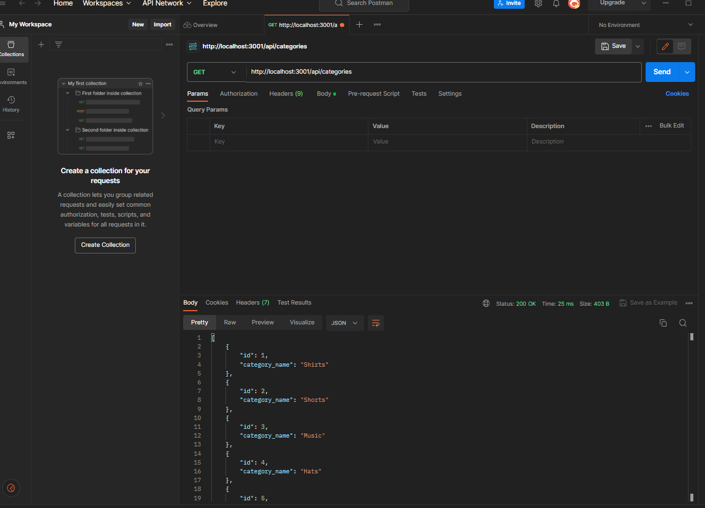

# backend_commercial 

</a>
 

## Description

https://www.loom.com/share/5c1c480bbe3f4817abcd345c08845f6d

This is an api using mysql. backend commercial api that gets, posts, and deletes data.

## Table of Contents

- [Installation](#installation)
- [Usage](#usage)
- [Questions](#Questions)

## Installation

run npm install and run the file. use postman or insomnia to use api.

## Usage

  load postman or insomnia to make requests to mysql database.

## Questions

JoseTorres26
https://github.com/JoseTorres26

